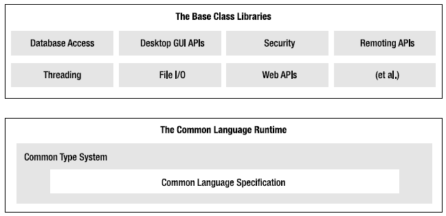

# .NET Framework

## Introducción

### Antes de .NET
En los 90's la programación en Windows estaba dividido en múltiples plataformas. Teníamos por ejemplo Visual Basic, C, C++. En el caso de C y C++ estaba ligado al uso de la API de Windows *Win32 API*, pero en su mayoría utilizaban *Microsoft Foundation Classes* o MFC. Finalmente para muchos la mejor alternativa era *Component Object Model* o COM porque ofrecía la orientación a objetos.

Estas plataformas tenía sus problemas. *Win32 API* no era orientada a objetos y requería un mayor esfuerzo que *MFC*. *MFC* con el tiempo se volvió inconsistente a pesar de ser orientado a objetos. En el caso de *COM* a pesar de tener un concepto más simple, requería bastante trabajo de configuración, se tenía que controlar los conflictos entre diferentes versiones de una misma aplicación o en el caso de dependendecias entre componentes de terceros como podían ser implementados con lenguajes distintos se obtenía en muchos casos incosistencias entre los tipos de datos.

Por otro lado con el surgimiento de Internet, las plataformas utilizadas para Windows no eran útiles para el desarrollo de aplicaciones  en este nuevo entorno. La diferencia entre programar para el entorno de escritorio y el entorno web estaba bien marcada.

### Preparando la próxima generación de plataformas
Lo que se necesitaba era un nuevo modelo de programación, basado en un entorno de trabajo o **Framework** integrado, orientado a objetos, que sea consistente y elegante a la vez.

Para lograr ello, Microsoft se propuso el desarrollo de un entorno de ejecución y un entorno de desarrollo que cumpla con esos objetivos:
  
  Entorno de ejecución
  - Mayor Seguridad
  - Múltiples plataformas
  - Mejor rendimiento
  
  Entorno de programación
  - Desarrollo orientado a objetos
  - Experiencia de programación consistente
  - Que promueva el uso de estándares de la industria
  - Despliegue simplificado
  - Independiencia de los lenguajes utilizados
  - Interoperabilidad
  
### Presentando Microsoft .NET
En 2002 Microsoft lanzó la primera versión de **.NET Framework** que solucionaba muchos de los problemas que se presentaban en COM o MFC. La plataforma también tenía como características su uso en múltiples plataformas (escritorio, PDA, teléfonos), el uso de nuevos estándares como XML, HTTP, SOAP, etc. y un entorno de ejecución mucho más seguro.

## Características de .NET Framework
.NET Framework es un cambio

### Componentes del Framework

#### Common Language Runtime - CLR
#### Common Type Specification - CTS
#### Common Language Specification - CLS
#### Base Class Library - BCL

# Visual Studio

# Bibliografía
- **Illustrated C# 2012, 4th Edition** por *Daniel M. Solis* - Apress, 2012
- **Pro C# 2010 and the .NET 4 Platform, 5th Edition** por *Andrew Troelsen* - Apress, 2010
- **C# 5.0 in a Nutshell, 5th Edition** por *Joseph Albahari y Ben Albahari* - O'Reilly, 2012